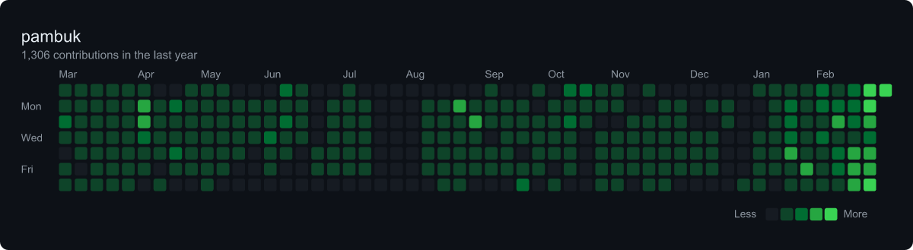

# gh-heatmap

Display your GitHub contribution heatmap as an image in your terminal.



## Prerequisites

- **Node.js** 18+
- **GitHub token** — [create one here](https://github.com/settings/tokens) (no scopes needed for public data)
- **chafa** (optional, for terminal display) — falls back to saving a PNG file

```bash
# Install chafa
brew install chafa        # macOS
apt install chafa         # Debian/Ubuntu
pacman -S chafa           # Arch
```

## Install & Run

```bash
# Clone and build
git clone <repo-url>
cd gh-heatmap
npm install
npm run build

# Set your token
export GITHUB_TOKEN=ghp_your_token_here

# Run
node dist/index.js torvalds
```

### Link globally (optional)

```bash
npm link
gh-heatmap torvalds
```

## Usage

```
gh-heatmap <username> [options]

Options:
  -t, --token <token>    GitHub token (or set GITHUB_TOKEN env var)
  -o, --output <path>    Save to file (.png or .svg)
  -w, --width <cols>     Terminal width for display
  --light                Use light theme (default: dark)
  --no-labels            Hide month/day labels
  --cell-size <px>       Cell size in pixels (default: 12)
  -h, --help             Show help
  -V, --version          Show version
```

## Examples

```bash
# Display in terminal (dark theme, default)
gh-heatmap octocat

# Light theme
gh-heatmap octocat --light

# Save as PNG
gh-heatmap octocat -o heatmap.png

# Save as SVG (for further editing)
gh-heatmap octocat -o heatmap.svg

# Adjust terminal width
gh-heatmap octocat -w 120
```

## Architecture

```
CLI args → GitHub GraphQL API → SVG template → resvg (PNG) → chafa → terminal
```

- **Data**: GitHub's GraphQL API (`contributionsCollection`) returns the full contribution calendar with colors
- **Rendering**: SVG built from scratch, converted to PNG via `@resvg/resvg-js` (Rust-based, no native deps)
- **Display**: `chafa` auto-detects terminal capabilities (Sixel, Kitty, iTerm2, Unicode)

## License

MIT
